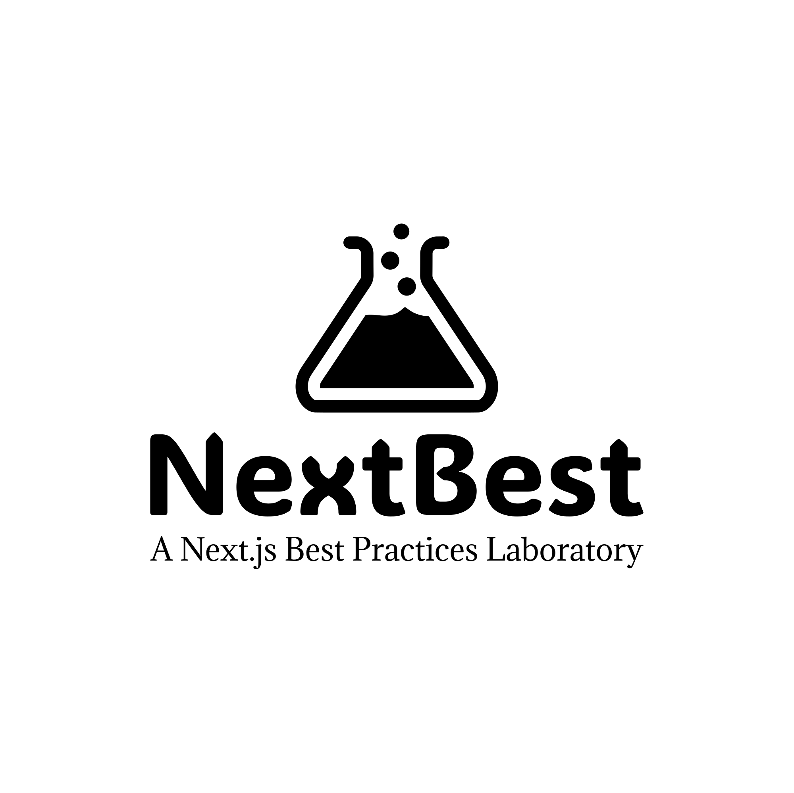

<div align="center">

<picture>
  <source media="(prefers-color-scheme: dark)" srcset="public/images/logo/logo_light.svg">
  <source media="(prefers-color-scheme: light)" srcset="public/images/logo/logo_dark.svg">
  
</picture>

# NextBest: A Next.js Best Practices Laboratory
</div>

Welcome to NextBest, a continuously evolving repository dedicated to showcasing best practices in modern web development using Next.js and its ecosystem.

## 🌟 Vision

NextBest aims to be a living, breathing example of excellence in web development. We're not just another boilerplate; we're a journey towards mastering the art of building robust, scalable, and maintainable web applications.

Our goal is to:
- Demonstrate best practices in action
- Evolve with the rapidly changing tech landscape
- Foster a community of passionate developers who strive for excellence

## 🚀 Features (Current & Planned)

- [x] Next.js 14 with App Router
- [x] TypeScript for type-safe code
- [x] Tailwind CSS for styling
- [ ] Dev Containers for consistent development environments
- [ ] Prisma with PostgreSQL for database management
- [ ] Authentication system
- [ ] Containerized deployment
- [ ] CI/CD workflows
- [ ] Typed APIs
- [ ] Form handling and validation
- [ ] ... and more to come!

## 🛠 Tech Stack

- **Framework**: [Next.js](https://nextjs.org/)
- **Language**: [TypeScript](https://www.typescriptlang.org/)
- **Styling**: [Tailwind CSS](https://tailwindcss.com/)
- **Database**: [PostgreSQL](https://www.postgresql.org/) (planned)
- **ORM**: [Prisma](https://www.prisma.io/) (planned)
- **Authentication**: To be decided
- **Deployment**: To be decided


## 🚦 Getting Started

1. Clone the repository:
   ```bash
   git clone https://github.com/yourusername/nextbest.git
   cd nextbest
   ```

2. Install dependencies:
   ```bash
   npm install
   ```

3. Run the development server:
   ```bash
   npm run dev
   ```

4. Open [http://localhost:3000](http://localhost:3000) in your browser.

## 🤝 Contributing

We believe in the power of community-driven development. If you have suggestions, best practices, or improvements to share, please:

1. Fork the repository
2. Create your feature branch (`git checkout -b feature/AmazingFeature`)
3. Commit your changes (`git commit -m 'Add some AmazingFeature'`)
4. Push to the branch (`git push origin feature/AmazingFeature`)
5. Open a Pull Request

All contributions, big or small, are warmly welcomed!

## 📜 License

This project is open source and available under the [MIT License](LICENSE).

## 🙏 Acknowledgements

- [Next.js Documentation](https://nextjs.org/docs)
- [React](https://reactjs.org/)
- [TypeScript](https://www.typescriptlang.org/)
- [Tailwind CSS](https://tailwindcss.com/)
- All our amazing contributors and the open-source community

---

Built with ❤️ by Ruben Schwan. Let's make the web better, together!